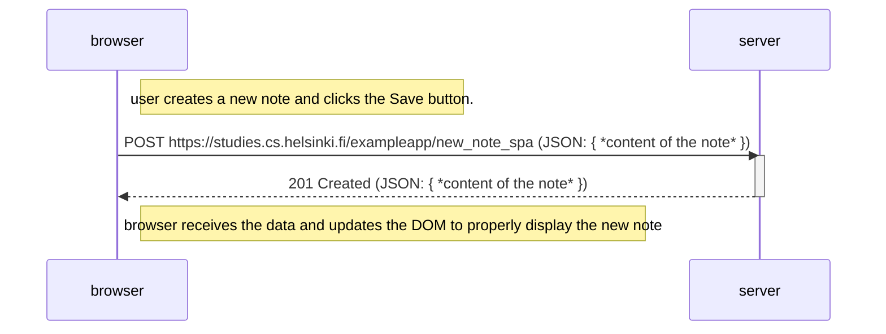

```mermaid
sequenceDiagram

    participant browser
    participant server

    Note right of browser: user creates a new note and clicks the Save button.

    browser->>server: POST https://studies.cs.helsinki.fi/exampleapp/new_note_spa (JSON: { *content of the note* })

    activate server
    server-->>browser: 201 Created (JSON: { *content of the note* })

    deactivate server
    Note right of browser: browser receives the data and updates the DOM to properly display the new note
```
